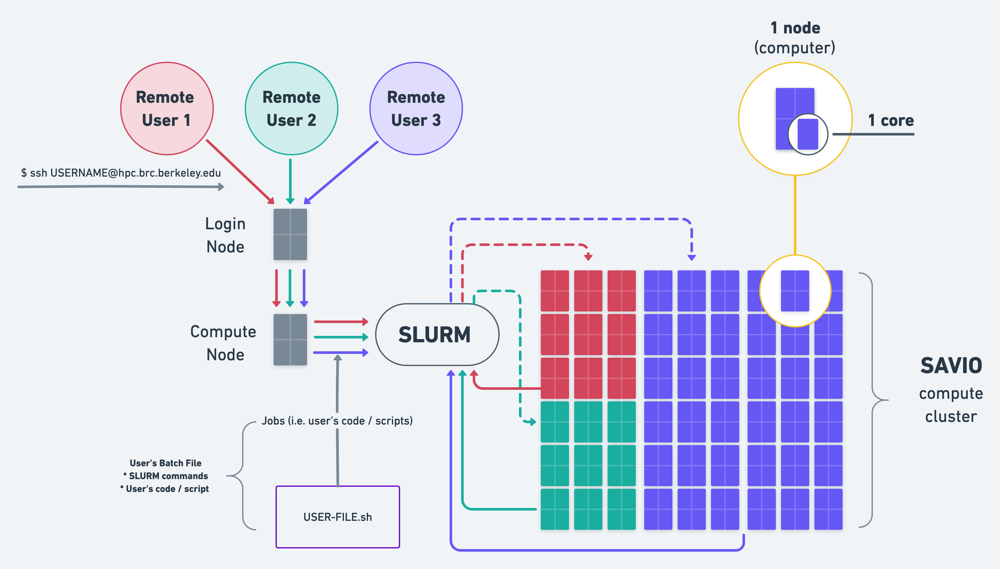

% Savio introductory training: Basic usage of the Berkeley Savio high-performance computing cluster
% October 12, 2020
% Oliver Muellerklein and Chris Paciorek


# Introduction

We'll do this mostly as a demonstration. We encourage you to login to your account and try out the various examples yourself as we go through them.

Much of this material is based on the extensive Savio documention we have prepared and continue to prepare, available at [http://research-it.berkeley.edu/services/high-performance-computing](http://research-it.berkeley.edu/services/high-performance-computing).

The materials for this tutorial are available using git at the short URL ([https://tinyurl.com/brc-oct20](https://tinyurl.com/brc-oct20)), the  GitHub URL ([https://github.com/ucb-rit/savio-training-intro-fall-2020](https://github.com/ucb-rit/savio-training-intro-fall-2020)), or simply as a [zip file](https://github.com/ucb-rit/savio-training-intro-fall-2020/archive/main.zip).

# Outline

This training session will cover the following topics:

 - System capabilities and hardware
     - Getting access to the system - FCA, condo, ICA
     - Login nodes, compute nodes, and DTN nodes
     - Savio computing nodes
     - Disk space options (home, scratch, group, condo storage)
 - Logging in, data transfer, and software
     - Logging in
     - Data transfer 
        - SCP/SFTP
        - Globus
        - Box & bDrive (Google drive)
     - Software modules
 - Submitting and monitoring jobs
     - Acounts and partitions
     - Basic job submission
     - Parallel jobs
     - Interactive jobs
     - Low-priority queue
     - HTC jobs
     - Monitoring jobs and cluster status
 - Basic use of standard software: Python and R
     - Jupyter notebooks
     - Parallelization in Python with ipyparallel
     - Parallelization in R with foreach
     - Dask for parallelization in Python
 - More information
     - How to get additional help
     - Upcoming events

# Few special notes about Github 

Github is a *code-repository-as-a-service* company that allows a user to store their Git based code project somewhere. It is simply a garage. Git, a low-level (i.e. Command Line based) software, is the true powerhouse that creates the lambos you park in the garage. 

Github is not the only code repository service. *E.g. Gitlab, Bitbucket*

### Github made a social justice decision Oct 1, 2020

Github recently (*as in Oct 1, 2020*) changed the default **branch naming convention** from **"master" to "main"**. These names are trivial - "master" was a convention that is used but is a thing of the past. 

Github made this decision as a call for the tech community to stop using unnecessary references to slavery. We struggly support this decision. We may still incorrectly use the terms "master branch" out of habit. Please correct us if we do so.

# System capabilities and hardware

- Savio is a 470-node, >11,600-core Linux cluster rated at nearly 450 peak teraFLOPS. 
   - about 40% of the  compute nodes provided by the institution for general access
   - about 60% compute nodes contributed by researchers in the Condo program


# Getting access to the system - FCA and condo

- All regular Berkeley faculty can request 300,000 service units (roughly core-hours) per year through the [Faculty Computing Allowance (FCA)](http://research-it.berkeley.edu/services/high-performance-computing/faculty-computing-allowance)
- Researchers can also purchase nodes for their own priority access and gain access to the shared Savio infrastructure and to the ability to *burst* to additional nodes through the [condo cluster program](http://research-it.berkeley.edu/services/high-performance-computing/condo-cluster-program)
- Instructors can request an [Instructional Computing Allowance (ICA)](http://research-it.berkeley.edu/programs/berkeley-research-computing/instructional-computing-allowance). 

Faculty/principal investigators can allow researchers working with them to get user accounts with access to the FCA or condo resources available to the faculty member.

# The Savio cluster

Savio is a Linux cluster - by cluster we mean a set of computers networked together such that you can:

 - access the system by logging into a "login node"
 - access your files on the system from any of the computers
 - run your computations across one or more of the "compute nodes"
    - your work might use parallelization to do computation on more than one CPU
    - you can also run "serial" jobs that use a single CPU


# Login nodes, compute nodes, and DTN nodes

Savio has a few different kinds of nodes:

 - login nodes: for login and non-intensive interactive work such as job submission and monitoring, basic compilation, managing your disk space
 - data transfer nodes: for transferring data to/from Savio
 - compute nodes: for computational tasks

# Simplified diagram of Savio 

Here is a simplified view of how accessing a supercomputer actually works. **SLURM is (the most) essential** to allow Savio and many other High Performance Clusters around the world work.

**SLURM** is the *Simple Linux Utility Resource Manager*. SLURM is very similar to *flight dispatcher + air traffic controller* at an airport. In this analogy planes are the jobs (*i.e. your code in a batch file*) that you send off into the sky / cluster...this also works to have a mental framework for Cloud Computing (*a bit different from HPC clusters like Savio but plenty of overlap*).

### What SLURM does

1. Allocates access to resources (compute nodes) to users for some duration of time
2. Handles starting, executing, and monitoring jobs on allocated nodes 
3. Manages queue of submitting jobs (*asyncronous*)

<center></center>

# Conceptual diagram of Savio

<center></center>

# Savio computing nodes

Let's take a look at the [hardware specifications](http://research-it.berkeley.edu/services/high-performance-computing/user-guide/hardware-config) of the computing nodes on teh cluster.

The nodes are divided into several pools, called partitions. These partitions have different restrictions and costs associated with them ([see the *Scheduler Configuration* section of this document](http://research-it.berkeley.edu/services/high-performance-computing/user-guide/running-your-jobs/scheduler-config) and [the associated costs in Service Units](http://research-it.berkeley.edu/services/high-performance-computing/service-units-savio#Scaling)). Any job you submit must be submitted to a partition to which you have access.

# Disk space options (home, scratch, group, condo storage)

You have access to the following disk space, described [here in the *Storage and Backup* section](http://research-it.berkeley.edu/services/high-performance-computing/user-guide/storing-data).

Those directories:

 - `/global/home/users/SAVIO_USERNAME`
 - `/global/scratch/SAVIO_USERNAME`
 - `/global/home/groups/SAVIO_GROUPNAME`

are available from any of the nodes and changes to files on one node will be seen on all the other nodes. 

When reading/writing data to/from disk, unless the amount of data is small, please put the data in your scratch space at `/global/scratch/SAVIO_USERNAME`. The system is set up so that disk access for all users is optimized when users are doing input/output (I/O) off of scratch rather than off of their home directories. Doing I/O with files on your home directory can impact the ability of others to access their files on the filesystem. 

Large amounts of disk space is available for purchase from the [*condo storage* offering](http://research-it.berkeley.edu/services/high-performance-computing/brc-condo-storage-service-savio). The minimum purchase is about $5,840, which provides roughly 42 TB for five years.


# Logging in

To login, you need to have software on your own machine that gives you access to a UNIX terminal (command-line) session. These come built-in with Mac (see `Applications -> Utilities -> Terminal`). For Windows, a good option is [PuTTY](http://www.chiark.greenend.org.uk/~sgtatham/putty/download.html).

You also need to set up your smartphone or tablet with *Google Authenticator* to generate one-time passwords for you.

Here are instructions for [doing this setup, and for logging in](http://research-it.berkeley.edu/services/high-performance-computing/logging-savio).

Then to login:
```
$ ssh SAVIO_USERNAME@hpc.brc.berkeley.edu
```

Your screen will then show the following: 

```
$ password:
```

On this prompt you will enter **your PIN followed by the one-time password** your Google Authenticator app will generate on your phone / tablet. 

**Note: you will NOT see any characters display on the "password:" prompt. This is a security measure** that is very simple and very smart to have implemented.

## Example login 

Let's pretend that my username, *omuellerklein*, has a PIN *1234*. Then I would do the following: 

```
$ ssh omuellerklein@hpc.brc.berkeley.edu
```

Then the following would appear: 

```
$ ssh omuellerklein@hpc.brc.berkeley.edu
$ password: 
```

*(Remember: our PIN, in this example 1234, is the first set of digits entered at the password prompt.)*

At the password prompt I would enter 1234*YYYYYY*, where *YYYYYY* is the one-time password from my Google authenticator app from my phone/tablet. *YYYYYY* will be shown when you open your *Google authenticator* app on your phone/tablet. However, *YYYYYY* will appear in the format *YYY YYY* on your authenticator app. Make sure you do not type the space between the two triplets of Ys on your password prompt. Google is just messing with you.

My phone's Google authenticator is going to display **567 890** in this example. Therefore, the full password prompt entered is **1234567890**. Wow - that is an interesting pattern! 

It will look as so **if you were actually able to see the password prompt:**

```
$ ssh omuellerklein@hpc.brc.berkeley.edu
$ password: **1234567890**
```

## Using the Linux environment

One can then navigate around and get information using standard UNIX commands such as `ls`, `cd`, `du`, `df`, etc. There is a lot of material online about using the UNIX command line (also called the shell; 'bash' is one common variation). Here is a [basic tutorial](https://github.com/berkeley-scf/tutorial-unix-basics).

If you want to be able to open programs with graphical user interfaces:
```
ssh -Y SAVIO_USERNAME@hpc.brc.berkeley.edu
```

To display the graphical windows on your local machine, you'll need X server software on your own machine to manage the graphical windows. For Windows, your options include *eXceed* or *Xming* and for Mac, there is *XQuartz*.

# Data transfer with examples to/from laptop, Box, Google Drive, AWS

To do any work on the system, you'll usually need to transfer files (data files, code files, etc.) to the Savio filesystem, either into your home directory, your scratch directory or a group directory.

And once you're done with a computation, you'll generally need to transfer files back to another place (e.g., your laptop).

Let's see how we would transfer files/data to/from Savio using a few different approaches. 

# Data transfer: SCP/SFTP

We can use the *scp* and *sftp* protocols to transfer files.

You need to use the Savio data transfer node, `dtn.brc.berkeley.edu`. The file `bayArea.csv` is too large to store on Github; you can obtain it [here](https://www.stat.berkeley.edu/share/paciorek/bayArea.csv).

Linux/Mac:

```bash
# to Savio, while on your local machine
scp bayArea.csv omuellerklein@dtn.brc.berkeley.edu:~/.
scp bayArea.csv omuellerklein@dtn.brc.berkeley.edu:~/data/newName.csv
scp bayArea.csv omuellerklein@dtn.brc.berkeley.edu:/global/scratch/omuellerklein/.

# from Savio, while on your local machine
scp omuellerklein@dtn.brc.berkeley.edu:~/data/newName.csv ~/Documents/.
```

If you can ssh to your local machine or want to transfer files to other systems on to which you can ssh, you can login to the dtn node to execute the scp commands:

```
ssh SAVIO_USERNAME@dtn.brc.berkeley.edu
[SAVIO_USERNAME@dtn ~]$ scp ~/file.csv OTHER_USERNAME@other.domain.edu:~/data/.
```

If you're already connected to a Savio login node, you can use `ssh dtn` to login to the dtn.

One program you can use with Windows is [WinSCP](https://winscp.net/eng/index.php), and a multi-platform program for doing transfers via SFTP is [FileZilla](https://filezilla-project.org/). After logging in, you'll see windows for the Savio filesystem and your local filesystem on your machine. You can drag files back and forth.

You can package multiple files (including directory structure) together using tar:
```
tar -cvzf files.tgz dir_to_zip 
# to untar later:
tar -xvzf files.tgz
```

# Data transfer: Globus

You can use Globus Connect to transfer data data to/from Savio (and between other resources) quickly and unattended. This is a better choice for large transfers. Here are some [instructions](http://research-it.berkeley.edu/services/high-performance-computing/using-globus-connect-savio).

Globus transfers data between *endpoints*. Possible endpoints include: Savio, your laptop or desktop, NERSC, and XSEDE, among others.

Savio's endpoint is named `ucb#brc`.

If you are transferring to/from your laptop, you'll need

1) Globus Connect Personal set up,
2) your machine established as an endpoint, and
3) Globus Connect Pesonal actively running on your machine. At that point you can proceed as below.

To transfer files, you open Globus at [globus.org](https://globus.org) and authenticate to the endpoints you want to transfer between. This means that you only need to authenticate once, whereas you might need to authenticate multiple times with scp and sftp. You can then start a transfer and it will proceed in the background, including restarting if interrupted. 

Globus also provides a [command line interface](https://docs.globus.org/cli/) that will allow you to do transfers programmatically, such that a transfer could be embedded in a workflow script.


# Data transfer: Box & bDrive

Box and bDrive (the Cal branded Google Drive) both provide free, secured, and encrypted content storage of files to Berkeley affiliates. bDrive provides unlimited storage, while Box no longer does. They are both good options for backup and long-term storage. Box has a maximum file size of 15 Gb while bDrive has a maximum file size of 5Tb.

You can interact with both services via web browser, and both services provide a desktop app you can use to move and sync files between your computer and the cloud.

 - [Box web app](http://box.berkeley.edu)
 - [Box desktop app](https://www.box.com/resources/downloads)
 - [bDrive web app](http://bdrive.berkeley.edu/)
 - [Drive desktop app](https://www.google.com/drive/download/)

For more ambitious users, Box has a Python-based SDK that can be used to write scripts for file transfers. For more information on how to do this, check out the `BoxAuthenticationBootstrap.ipynb` and `TransferFilesFromBoxToSavioScratch.ipynb` from BRC's cyberinfrastructure engineer on [GitHub](https://github.com/ucberkeley/brc-cyberinfrastructure/tree/dev/analysis-workflows/notebooks)

# Data transfer: Box & bDrive with rclone

[rclone](https://rclone.org/) is a command line program that you can use to sync files between both services and Savio. You can read instructions for using rclone on Savio [with Box and bDrive here](http://research-it.berkeley.edu/services/high-performance-computing/user-guide/transferring-data/rclone-box-bdrive).

Briefly the steps to set up rclone on Savio to interact with Box are as follows.

Configuration (on dtn): ```rclone config```

 - Use auto config? -> n
 - For Box: install rclone on your PC, then run ```rclone authorize "box"```
 - Paste the link into your browser and log in to your CalNet account
 - Copy the authentication token and paste into the ```rclone config``` prompt on Savio

rclone commands:
```
rclone listremotes # Lists configured remotes.
rclone lsd remote_name: # Lists directories, but not files. Note the trailing colon.
rclone size remote_name:home # Prints size and number of objects in remote "home" directory. This can take a very long time when tallying Tbs of files.
rclone copy /global/home/users/omuellerklein remote_name:savio_home/omuellerklein # Copies my entire home directory to a new directory on the remote.
rclone copy /global/scratch/omuellerklein/genomes remote_name:genome_sequences # Copies entire directory contents to a dirctory on the remote with a new name.
```

Finally you can set up [special purpose accounts](https://calnetweb.berkeley.edu/calnet-departments/special-purpose-accounts-spa) so files are owned at a project level rather than by individuals.

# Editing files

You are welcome to edit your files on Savio (rather than copying files back and forth from your laptop and editing them on your laptop). To do so you'll need to use some sort of editor. Savio has `vim`, `emacs`, and `nano` installed. Just start the editor from a login node.

```
## To use vim
vim myfile.txt
## To use emacs
emacs myfile.txt
## To use nano
module load nano
nano myfile.txt
```

# Software modules

A lot of software is available on Savio but needs to be loaded from the relevant software module before you can use it. (We do this not to confuse you but to avoid clashes between incompatible software and allow multiple versions of a piece of software to co-exist on the system.)

```
module list  # what's loaded?
module avail  # what's available
```

One thing that tricks people is that the modules are arranged in a hierarchical (nested) fashion, so you only see some of the modules as being available *after* you load the parent module (e.g., MKL, FFT, and HDF5/NetCDF software is nested within the gcc module). Here's how we see and load MPI.

```
module load openmpi  # this fails if gcc not yet loaded
module load gcc
module avail
module load openmpi
```

Note that a variety of Python packages are available simply by loading the python module. For R this is not the case, but you can load the *r-packages* module.

# Submitting jobs: overview

All computations are done by submitting jobs to the scheduling software that manages jobs on the cluster, called SLURM.

Why is this necessary? Otherwise your jobs would be slowed down by other people's jobs running on the same node. This also allows everyone to fairly share Savio.

The basic workflow is:

 - login to Savio; you'll end up on one of the login nodes in your home directory
 - use `cd` to go to the directory from which you want to submit the job
 - submit the job using `sbatch` (or an interactive job using `srun`, discussed later)
    - when your job starts, the working directory will be the one from which the job was submitted
    - the job will be running on a compute node, not the login node

# Submitting jobs: accounts and partitions

When submitting a job, the main things you need to indicate are the project account you are using and the partition. Note that their is a default value for the project account, but if you have access to multiple accounts such as an FCA and a condo, it's good practice to specify it.

You can see what accounts you have access to and which partitions within those accounts as follows:

```
sacctmgr -p show associations user=SAVIO_USERNAME
```

Here's an example of the output for a user who has access to an FCA, a condo, and a special partner account:
```
Cluster|Account|User|Partition|Share|GrpJobs|GrpTRES|GrpSubmit|GrpWall|GrpTRESMins|MaxJobs|MaxTRES|MaxTRESPerNode|MaxSubmit|MaxWall|MaxTRESMins|QOS|Def QOS|GrpTRESRunMins|
brc|co_stat|paciorek|savio2_1080ti|1||||||||||||savio_lowprio|savio_lowprio||
brc|co_stat|paciorek|savio2_knl|1||||||||||||savio_lowprio|savio_lowprio||
brc|co_stat|paciorek|savio2_bigmem|1||||||||||||savio_lowprio|savio_lowprio||
brc|co_stat|paciorek|savio2_gpu|1||||||||||||savio_lowprio,stat_gpu2_normal|stat_gpu2_normal||
brc|co_stat|paciorek|savio2_htc|1||||||||||||savio_lowprio|savio_lowprio||
brc|co_stat|paciorek|savio|1||||||||||||savio_lowprio|savio_lowprio||
brc|co_stat|paciorek|savio_bigmem|1||||||||||||savio_lowprio|savio_lowprio||
brc|co_stat|paciorek|savio2|1||||||||||||savio_lowprio,stat_savio2_normal|stat_savio2_normal||
brc|fc_paciorek|paciorek|savio2_1080ti|1||||||||||||savio_debug,savio_normal|savio_normal||
brc|fc_paciorek|paciorek|savio2_knl|1||||||||||||savio_debug,savio_normal|savio_normal||
brc|fc_paciorek|paciorek|savio2_gpu|1||||||||||||savio_debug,savio_normal|savio_normal||
brc|fc_paciorek|paciorek|savio2_htc|1||||||||||||savio_debug,savio_long,savio_normal|savio_normal||
brc|fc_paciorek|paciorek|savio2_bigmem|1||||||||||||savio_debug,savio_normal|savio_normal||
brc|fc_paciorek|paciorek|savio2|1||||||||||||savio_debug,savio_normal|savio_normal||
brc|fc_paciorek|paciorek|savio|1||||||||||||savio_debug,savio_normal|savio_normal||
brc|fc_paciorek|paciorek|savio_bigmem|1||||||||||||savio_debug,savio_normal|savio_normal||
```

If you are part of a condo, you'll notice that you have *low-priority* access to certain partitions. For example I am part of the statistics condo *co_stat*, which owns some savio2 nodes and savio2_gpu nodes and therefore I have normal access to those, but I can also burst beyond the condo and use other partitions at low-priority (see below).

In contrast, through my FCA, I have access to the savio, savio2, big memory, HTC, and GPU partitions all at normal priority.

# Submitting a batch job

Let's see how to submit a simple job. If your job will only use the resources on a single node, you can do the following. 


Here's an example job script that I'll run. You'll need to modify the --account value and possibly the --partition value.

```bash
#!/bin/bash
# Job name:
#SBATCH --job-name=test
#
# Account:
#SBATCH --account=co_stat
#
# Partition:
#SBATCH --partition=savio2
#
# Wall clock limit (30 seconds here):
#SBATCH --time=00:00:30
#
## Command(s) to run:
module load python/3.6
python calc.py >& calc.out
```

Now let's submit and monitor the job:

```
sbatch job.sh

squeue -j <JOB_ID>

wwall -j <JOB_ID>
```

After a job has completed (or been terminated/cancelled), you can review the maximum memory used via the sacct command.

```
sacct -j <JOB_ID> --format=JobID,JobName,MaxRSS,Elapsed
```

MaxRSS will show the maximum amount of memory that the job used in kilobytes.

You can also login to the node where you are running and use commands like *top* and *ps*:

```
srun --jobid=<JOB_ID> --pty /bin/bash
```

Note that except for the *savio2_htc*  and various GPU partitions, all jobs are given exclusive access to the entire node or nodes assigned to the job (and your account is charged for all of the cores on the node(s)).


# Parallel job submission

If you are submitting a job that uses multiple nodes, you'll need to carefully specify the resources you need. The key flags for use in your job script are:

 - `--nodes` (or `-N`): indicates the number of nodes to use
 - `--ntasks-per-node`: indicates the number of tasks (i.e., processes) one wants to run on each node
 - `--cpus-per-task` (or `-c`): indicates the number of cpus to be used for each task

In addition, in some cases it can make sense to use the `--ntasks` (or `-n`) option to indicate the total number of tasks and let the scheduler determine how many nodes and tasks per node are needed. In general `--cpus-per-task` will be 1 except when running threaded code.  

Here's an example job script for a job that uses MPI for parallelizing over multiple nodes:

```bash
#!/bin/bash
# Job name:
#SBATCH --job-name=test
#
# Account:
#SBATCH --account=account_name
#
# Partition:
#SBATCH --partition=partition_name
#
# Number of MPI tasks needed for use case (example):
#SBATCH --ntasks=40
#
# Processors per task:
#SBATCH --cpus-per-task=1
#
# Wall clock limit:
#SBATCH --time=00:00:30
#
## Command(s) to run (example):
module load intel openmpi
mpirun ./a.out
```

When you write your code, you may need to specify information about the number of cores to use. SLURM will provide a variety of variables that you can use in your code so that it adapts to the resources you have requested rather than being hard-coded. 

Here are some of the variables that may be useful: SLURM_NTASKS, SLURM_CPUS_PER_TASK, SLURM_NODELIST, SLURM_NNODES.

Some common paradigms are:

- 1 node, many CPUs
    - openMP/threaded jobs - 1 task, *c* CPUs for the task
    - Python/R/GNU parallel - many tasks, 1 per CPU at any given time
- many nodes, many CPUs
    - MPI jobs that use 1 CPU per task for each of *n* tasks, spread across multiple nodes
    - Python/R/GNU parallel - many tasks, 1 per CPU at any given time
- hybrid jobs that use *c* CPUs for each of *n* tasks
    - e.g., MPI+threaded code
   
There are lots more examples of job submission scripts for different kinds of parallelization (multi-node (MPI), multi-core (openMP), hybrid, etc.) [here](http://research-it.berkeley.edu/services/high-performance-computing/running-your-jobs#Job-submission-with-specific-resource-requirements).


# Interactive jobs

You can also do work interactively. This simply moves you from a login node to a compute node.

```
srun -A co_stat -p savio2  --nodes=1 -t 10:0 --pty bash
# note that you end up in the same working directory as when you submitted the job
# now execute on the compute node:
module load matlab
matlab -nodesktop -nodisplay
```

To end your interactive session (and prevent accrual of additional charges to your FCA), simply enter `exit` in the terminal session.

NOTE: you are charged for the entire node when running interactive jobs (as with batch jobs) except in the *savio2_htc* and *savio2_gpu* partitions. 

# Running graphical interfaces interactively on the visualization node

If you are running a graphical interface, we recommend you use Savio's remote desktop service on our visualization node, as described [here](http://research-it.berkeley.edu/services/high-performance-computing/using-brc-visualization-node-realvnc).

# Low-priority queue

Condo users have access to the broader compute resource that is limited only by the size of partitions, under the *savio_lowprio* QoS (queue). However this QoS does not get a priority as high as the general QoSs, such as *savio_normal* and *savio_debug*, or all the condo QoSs, and it is subject to preemption when all the other QoSs become busy. 

More details can be found [in the *Low Priority Jobs* section of the user guide](http://research-it.berkeley.edu/services/high-performance-computing/user-guide/savio-user-guide#Low_Priority).

Suppose I wanted to burst beyond the Statistics condo to run on 20 nodes. I'll illustrate here with an interactive job though usually this would be for a batch job.

First I'll see if there are that many nodes even available.

```
sinfo -p savio2
srun -A co_stat -p savio2 --qos=savio_lowprio --nodes=20 -t 10:00 --pty bash
## now look at environment variables to see my job can access 20 nodes:
env | grep SLURM
```

# HTC jobs (and long-running jobs)

There is a partition called the HTC partition that allows you to request cores individually rather than an entire node at a time. The nodes in this partition are faster than the other nodes.

```
srun -A co_stat -p savio2_htc --cpus-per-task=2 -t 10:00 --pty bash
## we can look at environment variables to verify our two cores
env | grep SLURM
module load python
python calc.py >& calc.out &
top
```

One can run jobs up to 10 days (using four or fewer cores) in this partition if you include `--qos=savio_long`.

# Alternatives to the HTC partition for collections of serial jobs
 
You may have many serial jobs to run. It may be more cost-effective to collect those jobs together and run them across multiple cores on one or more nodes.

Here are some options:

  - using [GNU parallel](http://research-it.berkeley.edu/services/high-performance-computing/user-guide/running-your-jobs/gnu-parallel) to run many computational tasks (e.g., thousands of simulations, scanning tens of thousands of parameter values, etc.) as part of single Savio job submission
  - using [single-node parallelism](https://github.com/berkeley-scf/tutorial-parallel-basics) and [multiple-node parallelism](https://github.com/berkeley-scf/tutorial-parallel-distributed) in Python, R, and MATLAB
    - parallel R tools such as *future*, *foreach*, *parLapply*, and *mclapply*
    - parallel Python tools such as  *ipyparallel*, *Dask*, and *ray*
    - parallel functionality in MATLAB through *parfor*

# Monitoring jobs, the job queue, and overall usage

The basic command for seeing what is running on the system is `squeue`:
```
squeue
squeue -u SAVIO_USERNAME
squeue -A co_stat
```

To see what nodes are available in a given partition:
```
sinfo -p savio
sinfo -p savio2_gpu
```

You can cancel a job with `scancel`.
```
scancel YOUR_JOB_ID
```

For more information on cores, QoS, and additional (e.g., GPU) resources, here's some syntax:
```
squeue -o "%.7i %.12P %.20j %.8u %.2t %.9M %.5C %.8r %.3D %.20R %.8p %.20q %b" 
```

We provide some [tips about monitoring your jobs](http://research-it.berkeley.edu/services/high-performance-computing/running-your-jobs#Monitoring). 

If you'd like to see how much of an FCA has been used:

```
check_usage.sh -a fc_cuore
```


# Example use of standard software: IPython and R notebooks through JupyterHub

Savio allows one to [run Jupyter-based notebooks via a browser-based service called Jupyterhub](http://research-it.berkeley.edu/services/high-performance-computing/using-jupyter-notebooks-and-jupyterhub-savio).

This is soon to be replaced by a more reliable and user-friendly service called Open OnDemand.

Let's see a brief demo of an IPython notebook:

 - Connect to https://jupyter.brc.berkeley.edu
 - Login as usual with a one-time password
 - Select how to run your notebook (on our stand-alone Jupyter node (`Local server`) or in the `savio2_htc`, `savio` or `savio2` partitions)
 - Start up a notebook

HOWEVER, the Jupyterhub service sometimes doesn't interact well with the SLURM scheduler causing your notebook not to start and no helpful error messages to be produced.  Instead, one can [run a Jupyter notebook through the visualization node](http://research-it.berkeley.edu/services/high-performance-computing/using-jupyter-notebooks-and-jupyterhub-savio) (see the material at the bottom of the webpage).

You can also run [parallel computations via an IPython notebook](http://research-it.berkeley.edu/services/high-performance-computing/using-jupyter-notebooks-and-jupyterhub-savio/parallelization).

# Example use of standard software: Python

Let's see a basic example of doing an analysis in Python across multiple cores on multiple nodes. We'll use the airline departure data in [bayArea.csv](https://www.stat.berkeley.edu/share/paciorek/bayArea.csv).

Here we'll use *IPython* for parallel computing. The example is a bit contrived in that a lot of the time is spent moving data around rather than doing computation, but it should illustrate how to do a few things.

First we'll install a Python package (pretending it is not already available via the basic python/3.6 module).

```
cp bayArea.csv /global/scratch/paciorek/.  # remember to do I/O off scratch
# install Python package
module unload python
module load python/3.6
pip install --user statsmodels
```

Now we'll start up an interactive session, though often this sort of thing would be done via a batch job.

```
srun -A co_stat -p savio2 --nodes=2 --ntasks-per-node=24 -t 30:0 --pty bash
```

Now we'll start up a cluster using IPython's parallel tools. To do this across multiple nodes within a SLURM job, it goes like this:
 
```
module load python/3.6 gcc openmpi
ipcontroller --ip='*' &
sleep 30
## The next line starts one worker per SLURM task (which should equal the number of cores)
srun ipengine &
sleep 45  # wait until all engines have successfully started
cd /global/scratch/paciorek
ipython
```

If we were doing this on a single node, we could start everything up in a single call to *ipcluster*:

```
module load python/3.6
ipcluster start -n $SLURM_CPUS_ON_NODE &
ipython
```

Here's our Python code (also found in *parallel.py*) for doing an analysis across multiple strata/subsets of the dataset in parallel. Note that the 'load_balanced_view' business is so that the computations are done in a load-balanced fashion, which is important for tasks that take different amounts of time to complete.

```
from ipyparallel import Client
c = Client()
c.ids

dview = c[:]
dview.block = True
dview.apply(lambda : "Hello, World")

lview = c.load_balanced_view()
lview.block = True

import pandas
dat = pandas.read_csv('bayArea.csv', header = None, encoding = 'latin1')
dat.columns = ('Year','Month','DayofMonth','DayOfWeek','DepTime',
'CRSDepTime','ArrTime','CRSArrTime','UniqueCarrier','FlightNum',
'TailNum','ActualElapsedTime','CRSElapsedTime','AirTime','ArrDelay',
'DepDelay','Origin','Dest','Distance','TaxiIn','TaxiOut','Cancelled',
'CancellationCode','Diverted','CarrierDelay','WeatherDelay',
'NASDelay','SecurityDelay','LateAircraftDelay')

dview.execute('import statsmodels.api as sm')

dat2 = dat.loc[:, ('DepDelay','Year','Dest','Origin')]
dests = dat2.Dest.unique()

mydict = dict(dat2 = dat2, dests = dests)
dview.push(mydict)

def f(id):
    sub = dat2.loc[dat2.Dest == dests[id],:]
    sub = sm.add_constant(sub)
    model = sm.OLS(sub.DepDelay, sub.loc[:,('const','Year')])
    results = model.fit()
    return results.params

import time
time.time()
parallel_result = lview.map(f, range(len(dests)))
#result = map(f, range(len(dests)))
time.time()

# some NaN values because all 'Year' values are the same for some destinations

parallel_result
```

And we'll stop our cluster. 

```
ipcluster stop
```

# Example use of standard software: R

Let's see a basic example of doing an analysis in R across multiple cores on multiple nodes. We'll use the airline departure data in *bayArea.csv*.

We'll do this interactively though often this sort of thing would be done via a batch job.

```bash
# remember to do I/O off scratch
cp bayArea.csv /global/scratch/paciorek/.

srun -A co_stat -p savio2  --nodes=2 --ntasks-per-node=24 -t 30:0 --pty bash
module load r/3.6.3 r-packages 
mpirun R CMD BATCH --no-save parallel-multi.R parallel-multi.Rout &
```

Now here's the R code (see *parallel-multi.R*) we're running:

```
library(doMPI)

cl = startMPIcluster()  # by default will start one fewer slave, using one for master
registerDoMPI(cl)
clusterSize(cl) # just to check

dat <- read.csv('/global/scratch/paciorek/bayArea.csv', header = FALSE,
                stringsAsFactors = FALSE)
names(dat)[16:18] <- c('delay', 'origin', 'dest')
table(dat$dest)

destVals <- unique(dat$dest)

# restrict to only columns we need to reduce copying time
dat2 <- subset(dat, select = c('delay', 'origin', 'dest'))

# some overhead in copying 'dat2' to worker processes...
results <- foreach(destVal = destVals) %dopar% {
    sub <- subset(dat2, dest == destVal)
    summary(sub$delay)
}


results

closeCluster(cl)
mpi.quit()
```

If you just want to parallelize within a node:

```
srun -A co_stat -p savio2 --nodes=1 -t 30:0 --pty bash
module load r
R CMD BATCH --no-save parallel-one.R parallel-one.Rout &
```

Now here's the R code (see *parallel-one.R*) we're running:
```
library(doParallel)

nCores <- Sys.getenv('SLURM_CPUS_ON_NODE')
registerDoParallel(nCores)

dat <- read.csv('/global/scratch/paciorek/bayArea.csv', header = FALSE,
                stringsAsFactors = FALSE)
names(dat)[16:18] <- c('delay', 'origin', 'dest')
table(dat$dest)

destVals <- unique(dat$dest)

results <- foreach(destVal = destVals) %dopar% {
    sub <- subset(dat, dest == destVal)
    summary(sub$delay)
}

results
```

You may also want to look into the `future` package for R, which provides a user-friendly interface to parallelization across one or more nodes. Here's a [tutorial on using future](https://github.com/berkeley-scf/tutorial-dask-future).

# Alternative Python Parallelization: Dask
In addition to iPyParallel, one of the newer tools in the Python space is [Dask](http://dask.pydata.org/en/latest/), which provides out-of-the-box parallelization more easily without much setup or too much additional work. Dask, as a Python package, extends Numpy/Pandas syntax for arrays and dataframes that already exists and introduces native parallelization to these data structures, which speeds up analyses. Since Dask dataframes/arrays are descendants of the Pandas dataframe and Numpy array, they are compatible with any existing code and can serve as a plug-in replacement, with performance enhancements for multiple cores/nodes. It's also worth noting that Dask is useful for scaling up to large clusters like Savio but can also be useful for speeding up analyses on your local computer.

We have materials available from [our fall 2019 training on using Dask on Savio](https://github.com/ucb-rit/savio-training-dask-2019) and from a [tutorial on using Dask](https://github.com/berkeley-scf/tutorial-dask-future).

We're also including some articles and documentation that may be helpful in getting started:     

- [Why Dask?](https://dask.pydata.org/en/latest/why.html)
- [Standard Dask Demo](https://www.youtube.com/watch?v=ods97a5Pzw0)
- [Why every Data Scientist should use Dask](http://dask.pydata.org/en/latest/api.html)
- [Dask Cheatsheet](https://dask.pydata.org/en/latest/_downloads/daskcheatsheet.pdf)
- [Detailed Dask overview video](https://www.youtube.com/watch?v=mjQ7tCQxYFQ)

# How to get additional help

 - For technical issues and questions about using Savio: 
    - brc-hpc-help@berkeley.edu
 - For questions about computing resources in general, including cloud computing: 
    - brc@berkeley.edu
    - office hours: Wed. 1:30-3:00 and Thur. 9:30-11:00 [on Zoom](https://research-it.berkeley.edu/programs/berkeley-research-computing/research-computing-consulting)
 - For questions about data management (including HIPAA-protected data): 
    - researchdata@berkeley.edu
    - office hours: Wed. 1:30-3:00 and Thur. 9:30-11:00 [on Zoom](https://research-it.berkeley.edu/programs/berkeley-research-computing/research-computing-consulting)

# Upcoming events and hiring

 - Research IT is hiring graduate students as [domain consultants](https://research-it.berkeley.edu/brc/domain-consultant). Please talk to one of us if interested.
 - [Sensitive Data](https://research-it.berkeley.edu/services/sensitive-and-protected-data): We are building a service and platform for researchers working with sensitive data. Secure VMs are available now and secure HPC cluster + storage are coming soon at a baseline capacity at no cost. Please get in touch if you are working with sensitive data. 
 - [Cloud Computing Meetup](https://www.meetup.com/ucberkeley_cloudmeetup/)
   - Monthly on last Tuesday
   - Next meeting on 10/27 
 - [Securing Research Data Working Group](https://dlab.berkeley.edu/working-groups/securing-research-data-working-group)
   - Monthly, next meeting on 10/26 


